# Assignment #4

이름: 윤병준 

개발환경: 

- Compiler: clang
- IDE: CLion
- Tested in Linux Environment, Visual Studio 2019

학번: 20190766

학과: 무은재학부

담당교수: 윤은영

POVIS ID: junyoon

## Honor code

"나는 이 프로그래밍 과제를 다른 사람의 부적절한 도움 없이 완수하였습니다."

## Problem : Image Registeration

### 1.1 문제의 개요

------

이미지파일을 표시하기 위해서는, RGB 세가지 값으로 한 픽셀을 표현해 색깔을 나타낸다. 이 각각의 색로만 이루워져있는 이미지파일의 일부를 채널이라고 한다. 이번 과제에서는 이미지 파일의 채널이 어긋난 파일을 받는다. 이 어긋난 파일에서 RGB데이터를 읽어서 채널의 위치를 다시 맞춰주는 이미지 정합을 하는 프로그램을 만드는 것이다. 

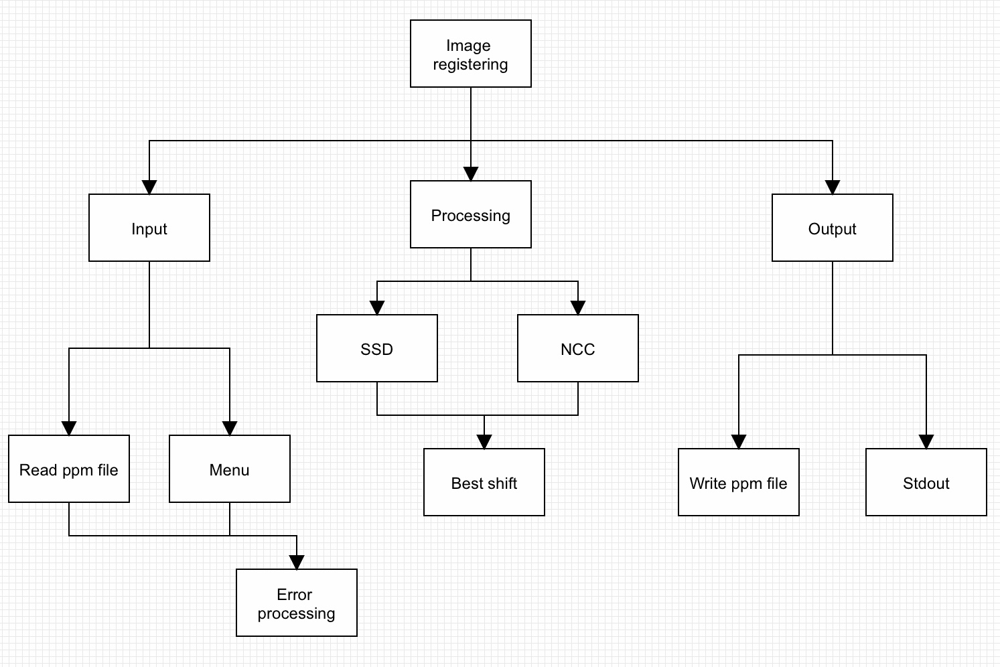

- 입력부:
  
  - 메뉴: 메뉴에서 사용자로부터 원하는 행동을 선택 받아 작동한다.
    - 이미지 불러오기 또는 변경하기: 이미지 파일이 로드가 되어있지 않으면 새로 불러오기, 이미 로드가 되어있으면 그 파일을 변경하기
    - SSD
    - NCC
    - 종료
  - 파일 입력: 프로그램과 같은 폴더에 확장자를 포함한 파일 길이가 30인 파일을 저장해두고, 프로그램에서 그 파일을 읽어온다.
  
- 처리부: 

  - 메뉴: 메뉴에서 선택한 정합 알고리즘을 사용하여 평가값을 계산한다. 
  - 파일 읽기: 이미지 파일을 읽어와서, 그 크기 만큼의 픽셀 갯수를 동적 할당한다. 
  - 데이터 저장: 정합을 완료한 후에, 줄어든 폭과 넓이를 받아서, 새로운 이미지 구조체에 동적 할당하고 새 RGB값을 쓴다

- 출력부: 

  - 파일 쓰기: 데이터 저장부에서 저장한 이미지 구조체를 읽어서 파일에 쓴다. 

    - ```int sprintf(char* str, const char* format, ...);``` 을 사용하여, 최종 파일 이름을 만든다. 
    - 만든 파일 이름으로 파일을 쓴다. 

  - stdout 

    -  각 채널의 쉬프트와 정합 방법의 이름을 포함한 파일이름으로 내보낸다. 그리고 그 결과를 다음과 같은 포맷으로 출력해준다. 

    ```
    SSD - R:[-9, 14] G:[-7, 15]
    결과 이미지 파일: lena_test_SSD_R-9_14_G-7_15.ppm
    ```

    

### 1.2 알고리즘 

---------

이 프로그램의 구현을 위한 알고리즘을 Pseudo 코드 형태로 나타내면 아래와 같다 

```
include header

int main
	menu
		1: 
			put img name to temp buf
			try to open image, if fail break
			if image is loaded, try to change it and cpy temp to filename, if fail break
		 	else if image read is success stcpy temp to filename
		 	else break
		2 or 3:
			if img is not loaded break
			start clock
			SSD or NCC for Red channel
			SSD or NCC for Green channel
			stop clock
			fill SSDed or NCCed image
			make output filename
			wirte img to outfile
			print result
			free SSDed or NCCed image
			
shift ssd and ncc
    init shift with INTMAX(ssd), -1 (NCC)
    for x_shift -15~15
        for y_shift -15~15
            eval = 0
            for all pixels
                eval += calcuation
            finalize eval
            if eval is better than previous stored eval
                update shift and eval
    return best_shift

```

위의 Psuedo code를 flowchart로 표현한다면 다음과 같다.  출력부의 이름을 출력하는 부분은 알고리즘과 별개이므로 생략했다. 

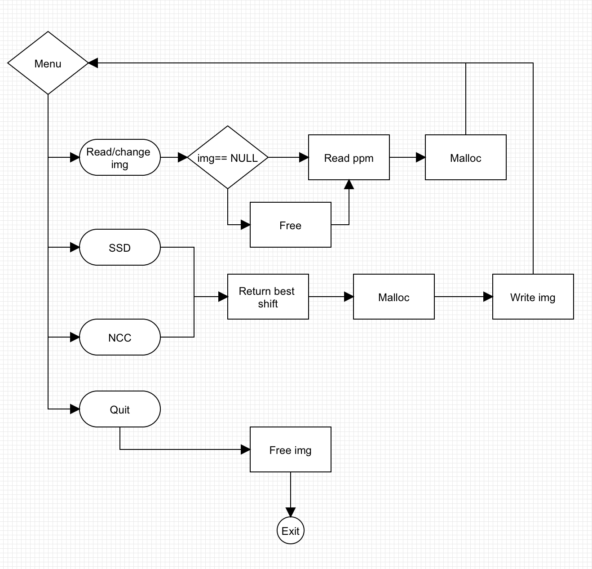


### 1.3 프로그램 구조 및 설명

--------------

#### 1.3.1 이미지 변경

이 프로그램에는 이미 이미지가 로딩되어 있을때를 대비해, 이미지 변경 기능이 로딩 메뉴 아래에 있다. 그래서 그것을 위한 if-else statement 처리가 필요했다. 그리고, 메뉴에서 현재 로딩되어있는 이미지 이름을 보여주는데, 존재하지 않는 이름을 입력해 파일 읽기에 실패해도 이 부분의 이미지 이름이 바뀐다. 그래서 ```temp``` 변수를 추가해 파일이름 입력을 ```temp``` 로 받고, 파일 읽기에 성공한 브렌치에서만 ```temp``` 를  ```filename```로 복사하였다. 

#### 1.3.2 이미지 구조체

이번 어싸인부터 ```typedef``` , ```struct``` 등의 제한이 풀리면서, 좀 더 편안하게 코딩할 수 있게 되었다. 이 프로그램에서는 이미지를 다루는 프로그램이다보니, 다음과 같은 구조체를 사용하였다. 

- 픽셀 타입
  - ```unsigned int``` *3 -> RGB 

- 이미지 타입
  - 폭, 높이
  - 픽셀 포인터
- 이미지 포인터 타입
  - ```typedef image_t *image; ```
- 쉬프트 타입
  - x축 이동, y축 이동
  - 평가값

이미지 포인터 타입을 사용하면서 ```->``` 연산자를 사용해, 함수의 매개변수로 받은 구조체의 내용을은 주소값으로 엑세스해 변경할 수 있게 하였다. 픽셀은 크키가 3인 배열이고, 이미지 타입의 픽셀 포인터는 폭과 높이를 사용해 크키가 3인 메모리를 픽셀의 수만큼 동적할당 받아 픽셀수*3크기의 2차원 배열을 만들었다.
그리고 동적할당을 구조체 내부에서 해주기 때문에, 할당은 위한 ```alloc_img(image img)``` ,  할당 해제를 위한 ```free_img(image img)``` 함수를 새로 만들었다. 이 두함수는 매개변수로 이미지 포인터 구조체를 받았을 때, 구조체 포인터와 
구조체 안에 데이터 멤버에 적절한 양의 공간을 할당하거나, 해제하는 역활을 하는 함수를 만들어 구조체를 사용할 때마다 여러번의 할당과 해제를 함수로 대체 하였다. 

#### 1.3.3 이미지 읽기 

이미지 파일은 raw text포맷으로 읽을수 있으므로, 읽기 모드는 read mode 로 파일을 연다. 파일 헤더에는 파일 타입, 폭, 크키, 깊이가 적혀있다. ``` P3 Width Height depth``` 의 형태로 젹혀져 있으므로 이 포맷에 맞춰서 ```%c%d %u %u %u\n``` 을 fscanf 로 읽으면 된다. 

#### 1.3.4 이미지 쓰기

이미지 쓰기는 총 두단계로 나뉜다. 

-  이미지 구조체 채우기
  - 원본 이미지, 각 채널의 쉬프트 값을 가지고 새로운 이미지 타입을 채워 넣는다. 최종 높이와 폭을 계산해서 동적할당을 해주고, 쉬프트한 값을 원본이미지에서 찾아서, 새로운 이미지 구조체에 넣어준다. 그 후, 완성된 이미지 구조체 포인터를 리턴한다. 
-  파일에 쓰기
   - ```writePPM(image img, const char *filename)```이 함수가 첫번째 스텝에서 리턴한 이미지 구조체를 받아, 파일에 쓴다. 일단 새로운 폭과 높이로 파일 헤더를 작성한다. ```Pixel```자료형은 정수 3개로 이루워진 구조체 이므로, ```img->data[i][0]``` 이런식으로 Red 채널에 엑세스 할 수 있다. 이렇게 픽셀 갯수만큼 반복문을 돌리면서 각 픽셀에서 RGB값을 뽑아서, 새 파일에 쓴다. 

#### 1.3.5 SSD (Standarized Square)

이 SSD방법은 평가값이 작을 수록 좋은 값이다. 따라서, 처음 쉬프트 타입의 초기화를 INT_MAX 를 평가값으로 지정해, 이 값보다 작은 값을 만나면, 
평가값을 그 값으로 업데이트하고 계속해서 루프를 돈다. 이로 인해 발생할만한 문제점으론, 이미지의 크키가 매우 커서, 가장 작은 SSD 평가값이 INT_MAX보다 작을때 이다. 하지만, 문제에서 주어진 이미지 파일들은 가로세로의 크키가 10비트(1024)를 넘지 않으므로 고려의 대상으로 삼지 않았다
또한, 이정도 크기의 이미지라면, 이미지를 읽고 동적 할당을 할 때, ```malloc()``` 으로 할당을 하면 에러가 날 정도의 크기일 가능성이 높다. (그 정도 크기라면 ```malloc()```이 아니라 ```mmap()```을 사용해야할 것이다.

#### 1.3.6 NCC (Normalized Cross)

이 방법은 위에 서술한 SSD보다 정확하게 이미지의 상관관계를 분석해서 평가한다. 이 값을 코싸인의 형태이므로 평가값의 범위는 -1 ~ 1 이고, 클수록 좋은 평가값이다. SSD에서 했던것처럼, ```shift_t``` 의 평가값을 -1 로 초기화하고 루프를 시작한다. 
그리고 루프를 돌다가, 저장되어있는 평가값보다 큰 평가값을 만나면, 평가값과 쉬프트를 업데이트한다. 이런 식으로 루프를 다 돌고 나면, 가장 높은 평가값과 그 평가값에 해당하는 쉬프트 값이 구조체 내에 저장되어 리턴될 것이다. 이 함수를 다 작성하고 디버깅할 때, 몇가지 문제가 있엇다. 
Green shift는 올바르게 리턴하는데 Red shift는 루프 마지막 값을 리턴하는 경우가 있었다. 그래서 평가값과 중간 계산 값들을 찍어보니 숫자 제곱끼리 더하고, 곱하고, 나눈 값이 음수가 나오는 것이다. 원인을 찾다보니, 숫자의 값이 너무 커져서, 정수의 표현의 범위를 넘어서, 
오버플로우가 일어나서, 음수로 나타나는 것이였다. 그래서 계산 중의 사용하는 중간 값들의 타입을 ``` unsigned long long```으로 변경하였다. 아마 실제로 이 타입의 맥스값까지 사용하지는 않을 테지만여 (실제로 테스트해본 결과 크기가 커도 ```unsigned int``` 범위 내), 만약 이미지의 크기가 커질때를 고려하여 큰 타입을 잡았다. 

#### 1.3.7 Improving the speed of registeration 
- ```pow()```in ```math.h``` v.s. simple square

    - 처음 프로그램을 짤 때는, 그냥 바로 생각나는 ```pow()``` 함수를 사용하여 프로그램을 짰다. 그런데, 이미지 정합에 걸리는 시간이 약 15초 정도 걸렸는데, 어떻게 하면 시간을 줄일 수 있을지 고민했다.
바이너리의 실행 시간은 덧셈과 뺄셈은 크게 영향을 받지 않고, 곱하기와 나누기 횟수에 영향을 받는다. 따라서, 제곱하는 부분의 시간을 줄이려고 했는데, ```pow()``` 함수를 사용하지 않을 때 시간이 3,4초 정도까지 단축 되었다. 
간단한 c프로그램을 만들어서 각 연산의 시간을 비교 보았다. 다음이 테스트 코드이다. 


   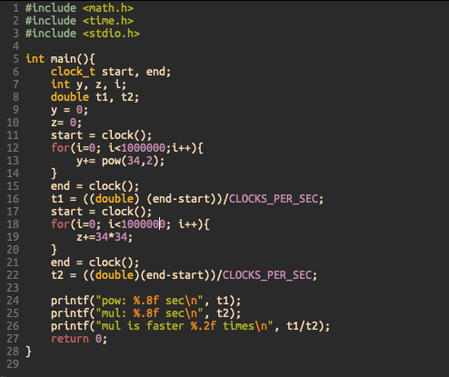


   이 코드로 테스트를 해본 결과, 각 방법의 시행시간은 무려 12배나 차이 났다. 


   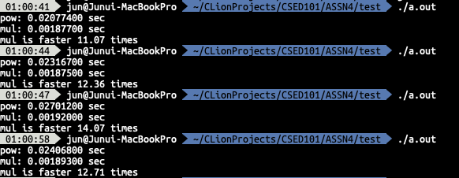
   
   최종적으로, 단순 제곱이 프로그램내 인스트럭션의 숫자를 줄 시행시간의 단축에 더 큰 도움이 되었다. 
- Compile with -O2 -O3 flag
    - 어싸인 안내에 있는 30초 제한 사항은 최적화 옵션이 없는 것을 가정한 연산 시간이겠지만, ppm 포맷이 크기 대비 이미지 해상도가 정말로 엄청나게 낮은 포맷이라 (압축이 하나도 안되있다!) Full HD 이미지 등의 처리가 느릴꺼 같아 
    좀 더 연산시간을 최적화 하려고 했다. 코드 상에서 가독성을 해치지 않는 선에서 최대한 최적화는 했기 때문에, 더 빠르게 하려면 어셈블리와 컴파일 레벨에서 최적화가 필요할 것 같아 Makefile에 -O2, -O3 옵션을 넣어서 컴파일 하였다. 
    옵션없이 컴파일 한 후 직접 만든 512 * 512 이미지 파일과 각 옵션의 SSD 연산 시간을 비교해보았다. 

   
    |컴파일 옵션|```test1.ppm```| ```lena_test.ppm```|
    |:---:|:---:|:---:|
    |no option|5.5 sec|15.5 sec|
    |-O2|0.550 sec|2.220 sec|
    |-O3|0.506 sec|2.343sec|
    
    
    이렇게 볼수 있듯이, 항상 O3 옵션이 O2보다 빠른 것은 아니고, 이정도 레벨의 함수 호출과 메모리 이용에서는 O2 옵션이 시행시간을 더 단축시키는 것을 볼수 있다. 
    어싸인의 경우 소스코드를 제출하는 것이기 때문에, 컴파일 옵션이 큰 의미는 없지만 테스트 해보았다. 
     
### 1.4 프로그램 실행 
---------
#### 1.4.1 메뉴 사용 방법
- 정상 입출력 
    - 1번을 선택해 정상적으로 이미지를 불러오고, 2번, 3번으로 정합을 한 후에 이미지를 할당 해제 하지 않고 들고 있는다. 이미지 변경을 시도하면 전에 할당했던 것을 해제하고, 새롭게 메모리를 할당한다. 
    - 존재하지 않는 파일 또는 형식에 맞지 않는 파일을 열려고 하면 적절한 에러메세지를 출력하고 메인 메뉴로 돌아간다. 
    - 1~4 이외의 정수 입력을 받았을 경우에도, 적절한 에러메세지를 출력하고 메인 메뉴로 돌아간다. 
    
    
    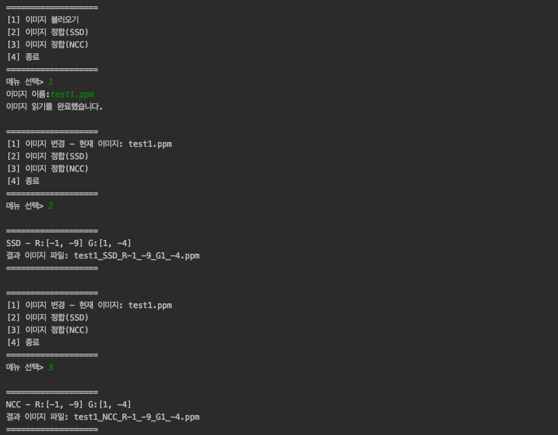
      
    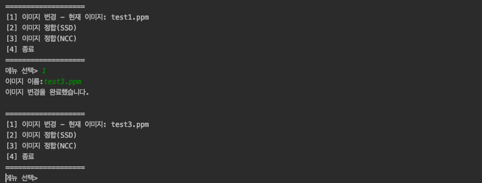
      
    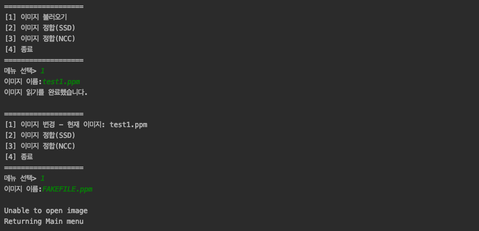
     
    
    
    
#### 1.4.2 Example
- test5
    - 기본으로 제공된 3개의 테스트 파일 중 test5의 실행 결과를 보자면, 정상적으로 NCC와 SDD를 진행하여 최종 파일을 정상적으로 작성하였다. 
    
    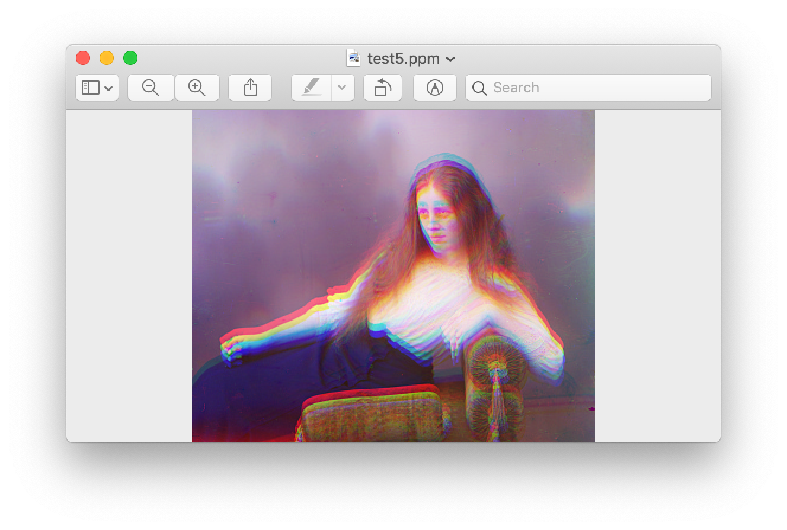
    
    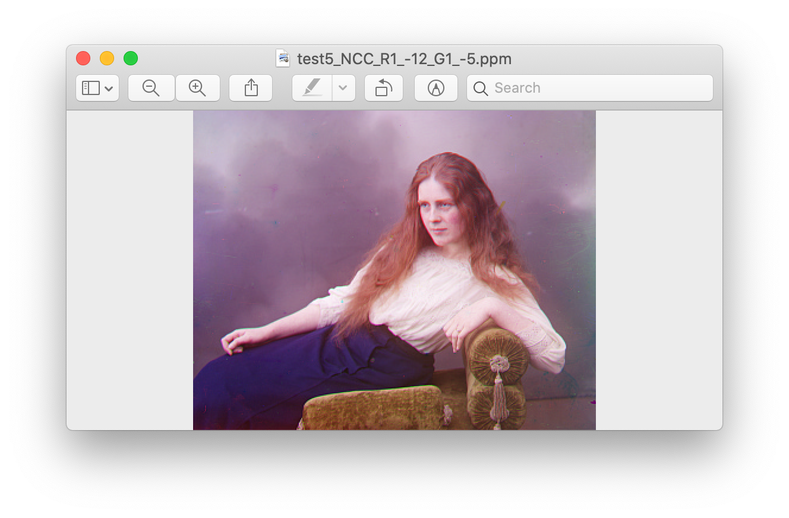
    
    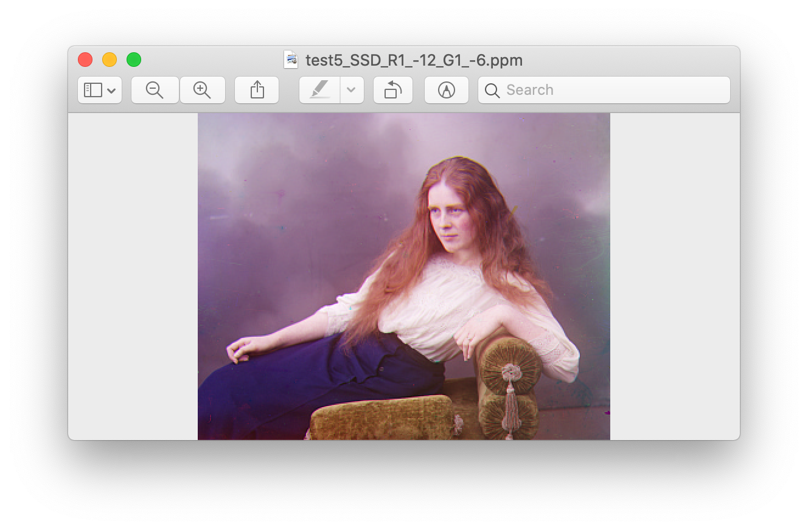
    
- additional test
    - 기본으로 제공된 테스트 파일 외로도 직접 파이썬 코드를 작성해 새로운 테스트 파일을 만들어 검증해보았다. 
    
    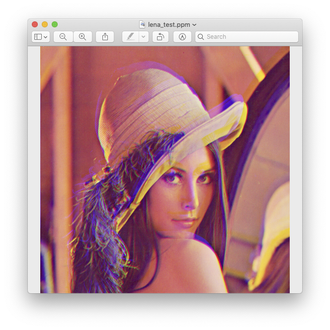
    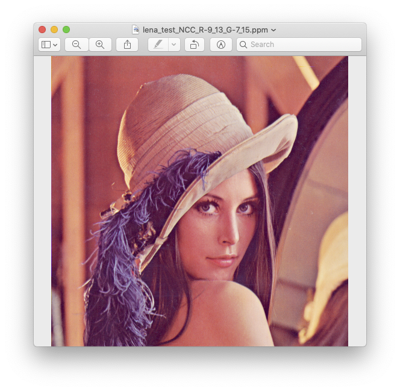


### 1.6 토론 및 결론

- 구조체를 사용하니 코드가 읽기는 쉬워졌지만 이해하기가 어렵단 점을 느꼈다. 사용자 정의 자료형을 이용하면 함수의 매개변수의 갯수를 줄인다거나 묶음으로 처리할 수 있기 때문에, 읽기는 쉽다. 하지만, 로직을 이해하는데에는 
사용자 정의라는 것이 프로그래머가 작성한 것이기 때문에 남들도 이해하기 쉽게 쓰려면 어려운 개념이라고 생각한다. 
- 처음 SSD를 작성할때, 분명 양수끼리 곱하고 나눴는데 음수가 나와서 당황했는데, 정수가 표현할 수 있는 자료형의 크기를 벗어나서 그랬던 것이다 (오버플로우). 따라서, 그 후로 자료형을 ```unsigned long long```으로 하였다. 
물론, 모든 변수에 해당 자료형이 필요한 것은 아니지만, 나중에 더 큰 이미지 파일을 다룰 때를 대비하여 남겨놓기로 하였다. 
- ```strtok()``` 함수를 최종 파일 이름을 만들 때 사용하였다. 그런데 해당 함수는 매개변수로 받는 문자열 자체를 바꿔버려서, 정합을 한 후에, 현재 이미지: ~~~ 이자리에 나타나는 이름에서 . 이후의 부분이 사라졌다.
```temp``` 버퍼를 추가해 해당 문제를 해결하였다. 또한, 파일이 읽히지 않았는데 현재 이미지란에 안 읽힌 파일의 이름이 나타났다. 좀 전의 에러를 처리하기 위해 사용한 임시 버퍼를 사용해 파일을 열고, 정상 열기가 되었을 때만, 
```filename``` 버퍼로 복사하였다. 

### 개선 사항
- 만약 배포를 목적으로 한다면 컴파일 옵션으로 최적화 하는 것도 실행 속도를 올리는데 도움이 될 것이다. 위에서 테스트 했든이, 굳이 O3 옵션이 아니더라도 O2가 더 빠르다. 
- 구조체를 사용해서 연산 속도가 느린 것인지 모르겠지만, 인스트럭션의 숫자를 줄여 최적화도 가능할 것이다. 
- 지금은 -15,-15 부터 15, 15까지 순차 탐색을 한다. 하지만, 실제로 평가값들을 찍어보면 정답에 가까워질수록 SSD는 더 작아지고 NCC는 커지는 경향이 있다. 이 차이가 작지 않기 때문에 대각선으로 탐색하고 그 것을 기준으로 
이진 탐색을 한다면, 연산 횟수를 많이 줄일 수 있을 것이다. 
